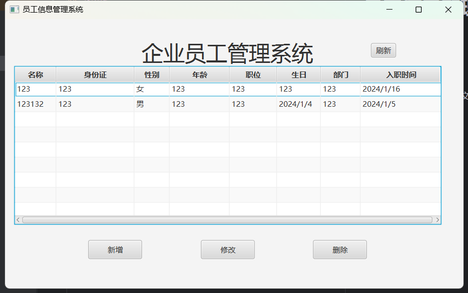
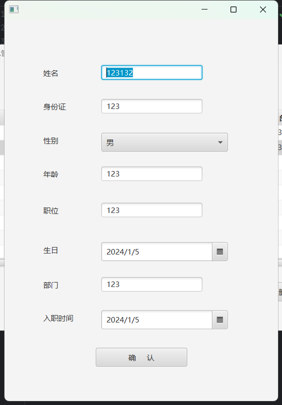

# 员工信息管理

## 技术栈
- JavaFX技术栈
- 数据信息使用本地txt文件存储

## 效果展示

> 展示界面
> 

> 修改/增加界面

## 常见错误
1. 
> Cannot set javafx.scene.control.TextField to field 'account'

> 类似这种错误，大概率是因为Controller导错包了, Javafx的包为javafx.scene.control，而不是java.awt

